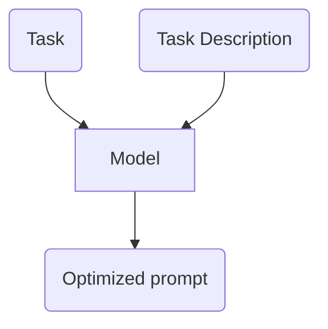

# Prompting_Tool

This project aims to create a developer tool to facilitate prompt engineering.

## Overview

### Problem Statement

When building GenAI applications having a good prompt that solves the task at hand, is one of the first task of the project.

But how does a good prompt look like, if:
- Prompts can be written following several techniques, each with a unique impact on outputs.
- Prompts won't generate the same results on different models.
- Prompts need to follow a manual and iterative process to be optimized.

Wouldn't it be nice to have a tool that can optimize my initial prompt and show the prompt optimized for different techniques as well?

After all, the art of prompting is the art of following patterns and styles to get the most out of a model.

### Is this an ML Problem?

Yes, and here is the definition of the ML problem.

#### ML Objective

| Application          | Business Objective                              | ML Objective                      |
| -----------          | ------------------                              | ------------                      |
| Prompt Crafting Tool | Reduce resources invested on prompt engineering | Maximize model response's quality |

#### System Inputs and Outputs

The application will take as an input:
- A task, which can be: Q&A, summarization, translation, etc.
- A task description or instruction, this can be considered as the initial (base) prompt.

The application will generate as output:
- An optimized prompt following the task and description provided.

#### ML Category

This problem can be framed as supervised learning problem or a reinforcement learning. 

**NOTE**: At the time of writing, I'm not sure which approach will yield the highest result.

## Goals

## Scope and Context

## System Design

## Alternatives Considered

## Learning Logs

| date | learning |
| ---- | -------- |
|      |          |
